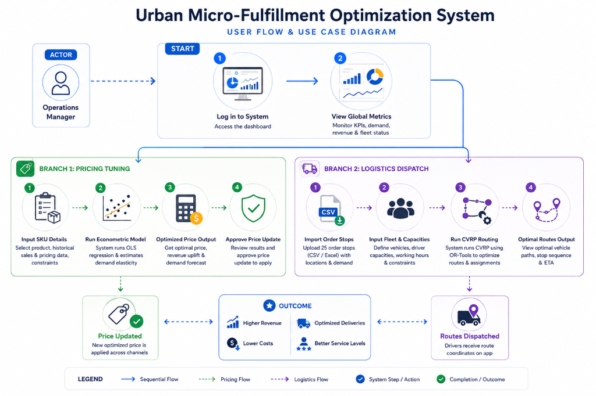

# 🛡️ MatruKavach AI
### AI-Powered Maternal Health Risk Detection & Support System

MatruKavach AI is an intelligent, context-aware maternal healthcare assistant designed to minimize preventable maternal mortality by detecting risks early. It bridges rural healthcare gaps by connecting pregnant mothers directly with ASHA (Accredited Social Health Activist) workers and doctors through a real-time, multi-agent AI system.

The application combines **environmental data (air quality, temperature, heat index)**, **clinical vitals (blood pressure, glucose, hemoglobin)**, and **local language voice messages (Hindi, Marathi)** to deliver proactive, real-time early warnings.

---

## 📸 Project Visualizations & Architectural Diagrams

### 1. System Architecture Diagram
The layout below illustrates how client interactions, the API server, database tables, and the multi-agent orchestration layer coordinate.


### 2. User Flow & Processing Lifecycle
This diagram walks through the step-by-step workflow of a patient submitting their information and how alerts are generated or parsed.



> [!NOTE]
> **To display these diagrams in this README:**
> Save the two uploaded screenshot files in the `docs/` folder in the project root as `architecture.png` and `user_flow.png`.

---

## 💡 How It Works (End-to-End Flow)

1. **Voice Input**: A pregnant mother sends a voice note in her native language (e.g., Hindi/Marathi) via the Telegram Bot.
2. **Translation & Parsing Engine**: The system transcribes the speech to text, translates it to English, and structures it into clinical metrics.
3. **Emergency Rule Engine (Bypass Loop)**:
   - The message content is immediately scanned for urgent keywords like **"bleeding"**, **"severe headache"**, or **"blurred vision"**.
   - If detected, the system bypasses AI processing entirely and issues an **instant RED alert** via Socket.IO directly to ASHA workers and doctors for immediate triage.
4. **Multi-Agent LangGraph Orchestration**:
   - If no critical keywords are found, the data is routed to a state-driven LangGraph network.
   - **Clinical Node**: Evaluates key vitals (systolic/diastolic blood pressure, glucose, weight, hemoglobin).
   - **Geospatial Node**: Uses the patient's coordinates to fetch local weather (temperature, apparent temperature) and air quality (PM2.5 AQI) from the **Open-Meteo API**.
   - **Guidance Node**: Generates a consolidated risk score (0-10) by applying environmental risk multipliers to clinical risk. It outputs specific clinical justifications, dietary adjustments, and environmental safety protocols using **Google Gemini**.
5. **Real-time Synchronization**: The FastAPI backend persists the results to the SQLite DB and pushes the updates instantly to the Next.js Dashboards using **Socket.IO** (WebSockets).

---

## 🛠️ Technology Stack

| Component | Technology | Description |
| :--- | :--- | :--- |
| **Frontend Dashboard** | Next.js (React), TailwindCSS, Clerk Auth | Clean UI for doctors and health workers with real-time reactive state. |
| **Backend API Server** | FastAPI (Python), Socket.IO (ASGI) | Asynchronous REST backend & real-time WebSocket communication. |
| **AI Orchestration** | LangGraph, LangChain, Google Gemini API | Coordinate workflows, structured agent reasoning, and vital parameter evaluations. |
| **Database** | SQLite, SQLModel (SQLAlchemy) | Embedded SQL database mapping models (MotherProfile, Assessment, Consultations). |
| **Integrations** | Telegram Bot API, Open-Meteo API | Direct communication and local environmental sensor/weather tracking. |
| **Containerization** | Docker, Docker Compose | Consistent environments and single-command deployment. |

---

## 📁 Repository Structure

```
MatruKavach AI/
├── backend/
│   ├── agents/            # LangGraph multi-agent implementation (clinical, nutrition, orchestrator)
│   ├── routers/           # FastAPI router endpoints (including telegram_bot routes)
│   ├── database.db        # SQLite local database
│   ├── main.py            # FastAPI App & Socket.IO server initialization
│   ├── models.py          # SQLModel database schemas (MotherProfile, RiskAssessment)
│   ├── telegram_poller.py # Telegram bot long-polling client
│   └── requirements.txt   # Python dependency list
├── frontend/
│   ├── app/               # Next.js App router pages (dashboard, patient logs, consultations)
│   ├── components/        # React dashboard UI cards, maps, charts, and alert modials
│   └── package.json       # Next.js scripts and packages
├── docs/                  # Project diagrams (architecture & user flow images)
└── docker-compose.yml     # Multi-container local orchestration script
```

---

## 🚀 Installation & Local Setup

Ensure you have **Python 3.10+**, **Node.js 18+**, and **Docker** (optional) installed.

### 1. Environment Variables Configuration

Create a `.env` file in the project root containing the following configurations (and verify they match the subfolders):

```env
# Google Gemini API
GOOGLE_API_KEY=your_gemini_api_key_here

# Telegram Integration (Create via BotFather)
TELEGRAM_BOT_TOKEN=your_telegram_bot_token

# Clerk Authentication (Next.js Dashboard Auth)
NEXT_PUBLIC_CLERK_PUBLISHABLE_KEY=your_clerk_publishable_key
CLERK_SECRET_KEY=your_clerk_secret_key

# Backend URL Configuration
NEXT_PUBLIC_API_URL=http://localhost:8000
```

---

### 2. Manual Startup (Without Docker)

#### **Step A: Start the Backend API & DB**
1. Navigate to the backend directory:
   ```bash
   cd backend
   ```
2. Create and activate a python virtual environment:
   ```bash
   python -m venv venv
   # On Windows (PowerShell):
   .\venv\Scripts\Activate.ps1
   # On macOS/Linux:
   source venv/bin/activate
   ```
3. Install dependencies:
   ```bash
   pip install -r requirements.txt
   ```
4. Seed/Initialize the Database (Creates test mothers, doctors, and ASHA profiles):
   ```bash
   python seed_db.py
   python seed_admin.py
   ```
5. Run the FastAPI development server:
   ```bash
   uvicorn main:socket_app --host 0.0.0.0 --port 8000 --reload
   ```

#### **Step B: Start the Telegram Voice Poller**
In a separate terminal (with the virtual environment activated):
```bash
cd backend
python telegram_poller.py
```

#### **Step C: Start the Frontend App**
1. Navigate to the frontend directory:
   ```bash
   cd ../frontend
   ```
2. Install npm dependencies:
   ```bash
   npm install
   ```
3. Run the Next.js development server:
   ```bash
   npm run dev
   ```
4. Open your browser and navigate to `http://localhost:3000`.

---

### 3. Quickstart Deployment with Docker Compose

To spin up the entire stack (FastAPI server, Socket.IO listeners, Next.js UI, Telegram poller) with a single command:

1. Ensure the root `.env` is updated with your API keys.
2. Spin up the containers:
   ```bash
   docker-compose up --build
   ```
3. Stop the services:
   ```bash
   docker-compose down
   ```

---

## 👥 Targeted User Roles

- **Pregnant Mothers**: Can interact in Hindi or Marathi, report symptoms via voice, and receive automatic feedback, reminders, and alerts.
- **ASHA Workers**: Track and visit mothers with the highest risk scores. Receive instantaneous audio/visual RED alerts on their live dashboards.
- **Doctors**: Analyze detailed clinical reasoning timelines, environmental summaries, and consult history, bypassing lengthy raw chat logs.
